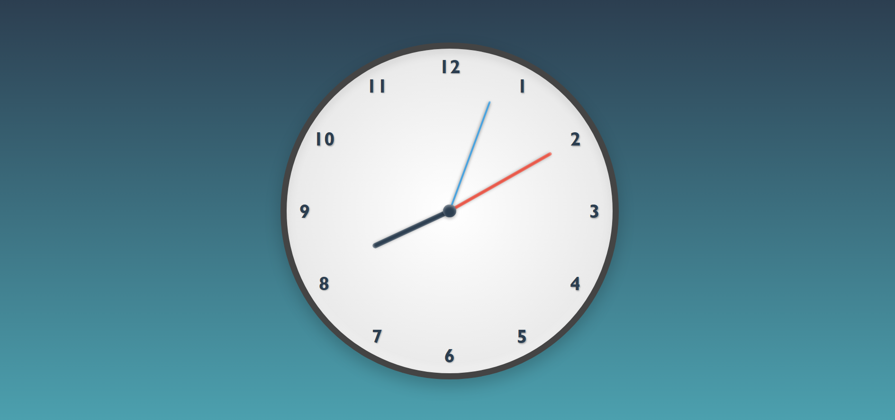

# 🕒 **Analog Clock Project**

## 📌 **Project Overview**

This project is a **Analog clock** built using **HTML**, **CSS**, and **JavaScript**. The clock features smooth animations, precise timekeeping, and a visually appealing design with modern styles and shadows.

---

## 🚀 **Features**

1. **Real-Time Time Display:** The clock dynamically displays the current time, updating every second.
2. **Smooth Animations:** The second, minute, and hour hands move seamlessly using `requestAnimationFrame`.
3. **Stylish Interface:** A clean design with gradients, shadows, and distinct colors for each clock hand.
4. **Accurate Timekeeping:** Uses `Date` and `requestAnimationFrame` for precise hand movements.

---

## 🛠️ **Technologies Used**

- **HTML5:** Structure of the clock.
- **CSS3:** Styling, gradients, and animations.
- **JavaScript:** Logic for clock movement and time calculations.

---

## 📂 **Project Structure**

```
/ Analog Clock
├── index.html    # Main structure of the clock
├── style.css     # Styling for clock design
└── script.js     # JavaScript for clock functionality
```

---

## 📑 **How It Works**

1. The **HTML** provides the structure, including clock hands, numbers, and a center dot.
2. The **CSS** styles the clock face, numbers, and hands, adding shadows and gradients for a polished look.
3. The **JavaScript** retrieves the current time using `Date` and updates the clock hands dynamically with `requestAnimationFrame`.

---

## 🖥️ **Setup Instructions**

1. Clone the repository:
   ```bash
   git clone https://github.com/Sourabh7singh/AnalogClock.git
   ```
2. Open the `index.html` file in your browser.
3. Enjoy your real-time analog clock! 🎉

---

## 📸 **Preview**



---

## 🤝 **Contributing**

Contributions are welcome!  
Feel free to fork the project, make improvements, and submit a pull request.

---